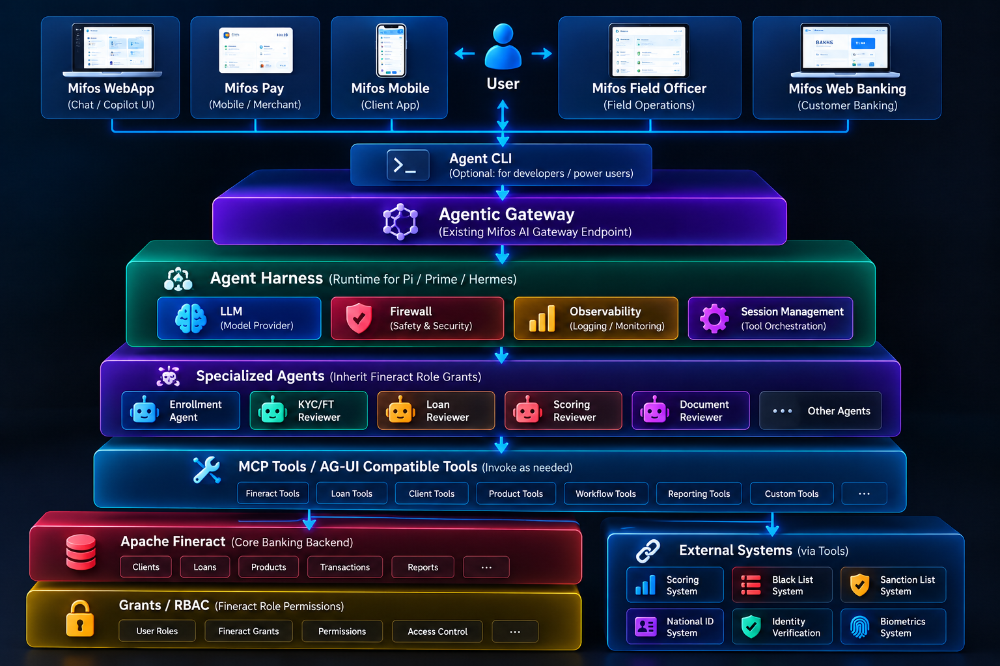

# Mifos MCP - Model Context Protocol (MCP) 

This project provides Model Context Protocol (MCP) for the Mifos X Ecosystem, enabling AI agents to access financial data and operations. 

Implementations are available in:
- **Go (Native)** — 102 typed tools (high-performance, cloud-native with SSE/Stdio).
- **Java (Quarkus)** — 38 typed tools (across Backoffice and Recommendations).
- **Python (FastMCP)** — 49 typed tools (modular domain-driven design).
- **Rust** — 89 typed tools (high-performance async I/O with exclusive bulk operations).

---

## Architecture Overview

The Mifos MCP Server acts as a standalone, stateless integration tier that bridges any AI assistant or agent framework to the **Apache Fineract** banking backend.

```text
┌──────────────────────────────────────────────┐
│            Apache Fineract / Mifos X          │
└───────────────────────┬──────────────────────┘
                        │ REST API
┌───────────────────────────────▼───────────────────────────────┐
│                 mcp-mifosx (Primary Repo)                     │
│                                                               │
│  ┌─────────────────┐ ┌─────────────────┐ ┌─────────────────┐ ┌─────────────────┐  │
│  │   /go (Native)  │ │ /java (Quarkus) │ │/python (FastMCP)│ │  /rust (Tokio)  │  │
│  │                 │ │                 │ │                 │ │                 │  │
│  │ - 102 Tools     │ │ - 38 Tools      │ │ - 49 Tools      │ │ - 89 Tools      │  │
│  │ - Go Routines   │ │ - Backoffice    │ │ - Modular Design│ │ - Async I/O     │  │
│  │ - SSE / Stdio   │ │ - Recommend.    │ │                 │ │ - Bulk Actions  │  │
│  └────────┬────────┘ └────────┬────────┘ └────────┬────────┘ └────────┬────────┘  │
└───────────┴───────────────────┼───────────────────┼───────────────────┴───────────┘
                        │ MCP Protocol (stdio / SSE)
          ┌─────────────┼──────────────┐
          ▼             ▼              ▼
    Mifos X WebApp   Claude Code     n8n / Custom
    AI Assistant     (claude.ai)     Workflow Agent
    (your client)   (external)       (your client)
```

This repository is **framework-agnostic**. The client (LLM brain, UI, memory) lives in a separate repository. Any MCP-compatible system can plug in.

---

## Agentic Platform Architecture

The [Agentic Gateway](agentic-gateway) builds on these MCP servers to replace the plain LLM gateway behind the Mifos X WebApp copilot with an agent harness running a swarm of specialized agents.



- **User channels** — Mifos WebApp (Chat / Copilot UI), Mifos Pay, Mifos Mobile, Mifos Field Officer and Mifos Web Banking. The **Agent CLI** is an optional entry point for developers and power users.
- **Agentic Gateway** — reuses the existing Mifos AI Gateway endpoint, but routes requests to an agent harness instead of directly to an LLM.
- **Agent Harness** (runtime for Pi / Prime / Hermes) — wraps every agent with the LLM model provider, an LLM firewall (safety & security), observability (logging / monitoring) and session management (tool orchestration).
- **Specialized Agents** — Enrollment Agent, KYC/FT Reviewer, Loan Reviewer, Scoring Reviewer, Document Reviewer and others. Their Fineract tool calls use the calling officer's credentials and permissions; agents do not have separate Fineract roles.
- **MCP Tools / AG-UI compatible tools** — Fineract, loan, client, product, workflow, reporting and custom tools, invoked as needed by the agents.
- **Apache Fineract + Grants / RBAC** — the core banking backend. Fineract enforces grants for the authenticated officer: if the officer's role has the required grant, the call (including write APIs) succeeds; otherwise, it is denied.
- **External Systems** (via tools) — Scoring, Black List, Sanction List, National ID, Identity Verification and Biometrics systems.

---

## Implementation Synchronization

While this repository hosts two different programming languages, they are kept in **functional parity** where possible to ensure a consistent experience.

### How they "Sync":
1. **Tool Specification**: All implementations aim to expose the same core banking tools. 
   - **Go** currently leads with **102 tools**, featuring advanced cloud-native features and SSE.
   - **Rust** provides **89 tools**, uniquely featuring high-concurrency Bulk Operations and robust "Fetch-and-Merge" state management.
   - **Python** provides **49 tools** using a modular domain design.
   - **Java** provides **38 tools** (21 for Backoffice operations and 17 for User Recommendations).
2. **API Alignment**: All implementations are built against the same **Apache Fineract REST API**. They share identical logic for field routing.
3. **Stateless Parity**: All implementations follow a strictly **stateless** design. None of the servers store user data, PII, or AI memory.
4. **Testing Protocol**: Shared "Smoke Tests" ensure that all implementations return identical, predictable JSON structures to the LLM.

---

## Project Structure

This repository is structured to support multiple implementations and client integrations.

```
.
├── README.md               # Root entry point & cross-implementation guide
├── go/                     # Go Implementation (Native / High-Performance)
│   ├── tools/              # 102 Domain-specific tools (SSE/Stdio)
│   ├── server/             # Dual-transport logic (HTTP/SSE & Stdio)
│   └── main.go             # Server entry point
├── rust/                   # Rust Implementation (Tokio/Reqwest)
│   ├── src/                # Multi-threaded typed tools & bulk execution logic
│   └── Cargo.toml          # Rust package dependencies
├── python/                 # Python Implementation (FastMCP)
│   ├── mcp_server.py       # Main entry point for the MCP server
│   ├── tools/              # Domain-specific banking tools (Loans, Clients, etc.)
│   └── core/               # API Gateway handlers
└── java/                   # Java Implementation (Quarkus)
    ├── backoffice/         # Core banking tools
    └── userrecommendation/ # Recommendation engine tools
```

---

## Getting Started

### 1. Choose Your Implementation

#### **Go (Native & Cloud-Ready)**
**Prerequisites**: Go 1.21+

**Steps**:
1. **Configure Environment**:
   Copy `go/.env.example` to `go/.env` and update credentials.
2. **Build and Run**:
   ```bash
   cd go
   go build -o mcp-server .
   ./mcp-server
   ```
3. **SSE Mode** (Optional):
   Define `PORT=8080` in `.env` to switch from Stdio to SSE microservice mode.

#### **Rust (High-Performance)**
**Prerequisites**: Rust (Cargo)

**Steps**:
1. **Configure Environment**:
   Copy `rust/.env.example` to `rust/.env` and update credentials.
2. **Build and Run**:
   ```bash
   cd rust
   cargo build --release
   ./target/release/mcp-rust-mifosx
   ```

#### **Java (Quarkus)**
**Prerequisites**: JDK 21+, Maven

**Steps**:
1. **Configure Environment Variables**:
   ```bash
   export MIFOSX_BASE_URL="https://your-fineract-instance"
   export MIFOSX_BASIC_AUTH_TOKEN="your_api_token"
   export MIFOS_TENANT_ID="default"
   ```
2. **Run via JBang**:
   ```bash
   jbang --quiet org.mifos.community.ai:mcp-server:1.0.0-SNAPSHOT:runner
   ```
3. **Build Native Executable** (Optional):
   ```bash
   cd java/backoffice
   ./mvnw package -Dnative
   ./target/mcp-server-1.0.0-SNAPSHOT-runner
   ```

#### **Python (FastMCP)**
**Prerequisites**: Python 3.10+, pip

**Steps**:
1. **Navigate to the Python directory**:
   ```bash
   cd python
   ```
2. **Install dependencies**:
   ```bash
   pip install -r requirements.txt
   ```
3. **Configure Environment**:
   Copy `.env.example` to `.env` and fill in your details.
4. **Run the Server**:
   ```bash
   python mcp_server.py
   ```

---

## Available Tools Summary

The exact number and categorization of tools depend on the core server implementation deployed:

### Go (102 Tools)
*The most feature-complete implementation with native concurrent routines.*
- **Clients & Identities**: 16 Tools
- **Documents & Reports**: 26 Tools
- **Loans & Savings**: 23 Tools
- **Groups & Centers**: 13 Tools
- **Bulk & Composite**: 19 Tools (Cloud-Native)
- **Accounting & Stats**: 5 Tools

### Rust (89 Tools)
*Built for asynchronous scale, bulk processing, and robust state-aware updates.*
- **Clients & Collaterals**: 25 Tools
- **Loans & Collaterals**: 19 Tools 
- **Groups, Savings & Centers**: 23 Tools
- **Staff, Accounting & Charges**: 11 Tools
- **Bulk Operations**: 11 Tools *(Exclusive to Rust)*

### Python (49 Tools)
*Domain-driven design bridging AI directly to Fineract.*
- **Clients & Groups**: 16 Tools
- **Loans & Savings**: 20 Tools
- **Staff & Accounting**: 13 Tools

### Java (38 Tools)
*Enterprise suite categorized between Backoffice and recommendation engines.*
- **Backoffice Operations**: 21 Tools *(Covers Clients, Loans, Savings)*
- **User Recommendations**: 17 Tools *(Exclusive to Java)*

---

## Testing with MCP Inspector

Use the **MCP Inspector** to test and debug your server interactively:

```bash
npx @modelcontextprotocol/inspector <command_to_run_yours_server>
```

**For Python**:
```bash
npx @modelcontextprotocol/inspector python python/mcp_server.py
```

---

## Examples - Backoffice Agent

| Video URL | Title | Prompt | Implementation |
| :--- | :--- | :--- | :--- |
| https://youtu.be/MDQKRoz5GKw?si=69X77C58nFhy6Ioh | Join and Try the Mifos MCP | Go to https://ai.mifos.community | **Go / Java / Python / Rust** |
| https://youtu.be/y5MR3j8EGM4?si=zXTurBNql4xF5CGY | Create Client | Create client using name: OCTAVIO PAZ, email: octaviopaz@mifos.org, etc. | **Go / Java / Python / Rust** |
| https://youtu.be/qJsC25cd-1g?si=qQzX8DeOe0_2qhfr | Activate Client | Activate the client OCTAVIO PAZ | **Go / Java / Python / Rust** |
| https://youtu.be/X1g_nVDsRnM?si=K7vsAN7gOLEC2OG0 | Add Address to Client | Add the address to the client OCTAVIO PAZ (Plaza de Loreto) | **Java** |
| https://youtu.be/xeL9_sycwA8?si=AtV6F4WhTvcDspSp | Add Personal Reference | Add Maria Elena Ramírez as sister to OCTAVIO PAZ | **Java** |
| https://youtu.be/IKGMeAJBAOk?si=N27rE64dn7qxmMBk | Create a Loan Product | Create default loan product named "SILVER" (10% interest) | **Java** |
| https://youtu.be/5EdgUyLyP0w?si=L0UdYjXlyYF6faL5 | Create Loan Application | Apply for individual loan for OCTAVIO PAZ using SILVER | **Go / Java / Python / Rust** |
| https://youtu.be/2ioN_8z_uaY?si=ZTB5rCrgS2jTpC4- | Approve Loan | Approve the loan account | **Go / Java / Python / Rust** |
| https://youtu.be/dDebmrn4lB0?si=0GTf4asCBHnsu27f | Disbursement of Loan | Disburse loan account using Money Transfer | **Go / Java / Python / Rust** |
| https://youtu.be/N3wnyJCh_Ik?si=gSy5LrJdFF2kfzHd | Make Loan Repayment | Make a repayment for account 6 (Amount: 6687.59) | **Go / Java / Python / Rust** |
| https://youtu.be/bOuTj97hyqU?si=9bpno4Kp0II1IfPY | Create Savings Product | Create default savings product named "WALLET" | **Java** |
| https://youtu.be/l-Z7LlE3AnM?si=yQM4lloJL8Hu6yv8 | Create Savings App | Apply for savings account for OCTAVIO PAZ using WALLET | **Go / Java / Python / Rust** |
| https://youtu.be/Q5ExlhalG8U?si=TwbsUZX30G3JeNJy | Approve Savings App | Approve the savings account with note "MY FIRST APPROVAL" | **Go / Java / Python / Rust** |
| https://youtu.be/DJgUiRYK-rE?si=YatfVgOgpbP4wV91 | Activate Savings | Activate the savings account | **Go / Java / Python / Rust** |
| https://youtu.be/Od7KFqktUtI?si=gPJNlLOB_7D74QdS | Make a Deposit | Create DEPOSIT of 5000 for account 1 | **Go / Java / Python / Rust** |
| https://youtu.be/9OL6N5wKG7c?si=R50RjTK6GI_ODuUs | Make a Withdrawal | Create WITHDRAWAL of 2000 for account 1 | **Go / Java / Python / Rust** |

---

## Security & Guardrails
- **Universal Compatibility** — Works with Claude, GPT-4, Qwen, or any MCP client.
- **Data Sovereignty** — The server makes no external calls. 
- **RBAC Enforced** — Every action is validated against Fineract's native permissions.

---

## Contact & Community

- Mifos Community: https://mifos.org
- Mifos MCP (Docker): https://hub.docker.com/r/openmf/mifos-mcp
- Chatbot Demo: https://ai.mifos.community
